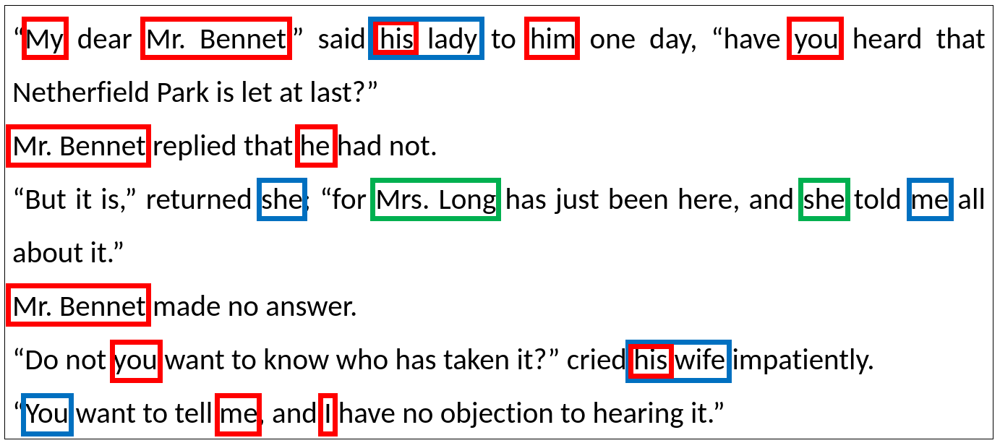

# ProtagonistTagger 

## Tagging Mentions of Persons -- Recognition and Disambiguation -- in Natural Language Texts

This work is a continuation and an extension of a previous project in the literature domain -- thesis *Preparation of Sets and Machine Learning Models for Recognizing Names of Literary Characters* ([WerLaj/protagonist_tagger](https://github.com/WerLaj/protagonist_tagger)). The final effect of that work was a tool that detects person-type entities in text and then assigns them to specific heroes. 

In this work, I have improved the tool and tests, particularly:
* enhanced the results achieved by the NER model in recognizing people, 
* extended and made more general the rules for heroes' disambiguation, *
* incorporated detection of mentions of characters in the form of pronouns and nominals; it also includes adapting open datasets to the Coreference Resolution and using them to evaluate *protagonistTagger* tool

Figure below presents expected output of the tool.Given text is a conversation between two main characters of the novel *Pride and Prejudice* by Jane Austen - Mr. Bennet and his wife, Mrs. Bennet. During the conversation, they also mentioned the third character - Mrs. Long. In this figure, all mentions of these characters are marked by corresponding colors - Mr. Bennet by red, Mrs. Bennet by blue and Mrs. Long by green. 




## Installation

To clone this repository you should run following command:

```bash
git clone https://github.com/airi314/protagonist_tagger
```

We use several repositories which should be cloned into `resources` directory.
```bash
cd protagonist_tagger
mkdir resources
git clone https://github.com/shtoshni/fast-coref
git clone https://github.com/shtoshni/long-doc-coref
git clone https://github.com/vdobrovolskii/wl-coref
git clone https://github.com/conll/reference-coreference-scorers
git clone https://github.com/dbamman/litbank
```

## Project Workflow

The workflow of the refined version of the *protagonistTagger* tool consists of several steps:
* **Building a list of main characters** -- This step is based on Wikipedia scraping.
* **Detection of all character occurrences** -- It means finding all *person* type entities in the text based on the Named Entity Recognition (NER) model fine-tuned on literary texts.
* **Disambiguation of character occurrences** -- It means assigning a corresponding protagonist name from the list of main characters to each person entity found. It is based on the similarity of strings, as well as gender and personal title rules.
* **Extending the mentions of characters with pronouns and nominals** -- In this step Coreference Resolution model is applied, and pronouns such as *he* or nominals like *his wife* are assigned to proper protagonists.


## What can you find here
This repository comprises three main parts:
1. corpus of twelve novels in English annotated by our tool with full names of protagonists (see *annotated_corpus/*)
2. data set containing: 
    + the following  information about each novel:
        + full plain text of novel (see *data/complete_literary_texts/*)
        + list of literary characters scraped from Wikipedia (see *data/lists_of_characters/*)
    + testing sets (see *data/testing_sets/test/*)
    + gold standards annotations of tag PERSON (see *data/testing_sets/test_person_gold_standard_corrected/*)
    + gold standards annotations of full names of literary characters (see *data/testing_sets/test_names_gold_standard_corrected/*)
3. **ProtagonistTagger** tool itself with several scripts that make it easy to reuse.
    + Python scripts for annotating text with different annotation layers (see *tool/scripts/* and section below)
    + bash script for evaluating different NER and CR models and reproducing results from the thesis (see *tool/evaluation/*)

## How to use the protagonistTagger

In order to make the tool easy to use, there are several scripts offering most important functionalities. The scripts are located in *protagonist_tagger/tool/scripts* and they can be simply launched from terminal with a set of necessary arguments. The following scripts are available:
+ *annotate_ner.py* - given NER model, novels texts (either full or only some extracted sentences), it annotates the given text with general tag PERSON using given NER model;
+ *annotate_protagonist.py* - given list of literary characters, NER model, novels texts (either full or only some extracted sentences), precision (for approximate string matching) and set of rules, it annotates the given text with names of literary characters from the list
+ *annotate_coreference.py* - given list of literary characters, CR model, novels texts (either full or only some extracted sentences), it detects clusters of mentions in the given text
+ *merge_ner_coreference.py* - given results of NER, EL and CR steps, it combines them and returns text annotated with mentions of protagonists in all forms (proper nouns, pronouns and nominals)
+ *compute_metrics.py* - given predictions generated by the model and gold-standard, it computes metrics 
+ *prepare_training_data.py* -- given training data and some model parameters, it fine-tuned *ner-large* model. Using default values allowst allows reproducing results.

Detailed information about input arguments and functionalities implemented in each script can be found in comments in corresponding Python files. 
